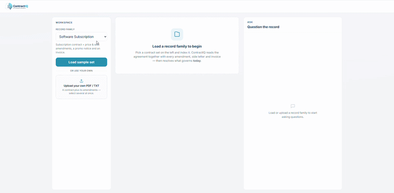

# ContractIQ

An AI app that reads a contract with all its changes and tells you what currently applies, with the source for every answer.



## The problem it solves

Contracts rarely stay the same. Over time they collect amendments, side letters, price updates, promotional notices and invoices. After a while it becomes hard to answer a simple question: *what actually applies right now?* The original document says one thing, a later amendment says another, and a promotion may have already expired.

ContractIQ reads the whole set of documents together (the "record family"), works out the current state, and backs every answer with the document it came from.

## How it works

When you load a set of documents, the app:

1. Extracts the text from each PDF or TXT file.
2. Splits the text into small overlapping pieces and turns each piece into an embedding (a numeric representation of its meaning).
3. For the analysis, it reads all documents together and resolves conflicting or superseded terms into a single current view.
4. For the chat, it finds the most relevant pieces for your question (vector search) and lets the model answer using only those pieces. This is a retrieval-augmented generation (RAG) approach, which keeps answers grounded in the documents instead of made up.

## Features

- **Three sample datasets** of increasing complexity (a subscription, an office lease, an employment contract), each with deliberately conflicting and expiring terms.
- **Upload your own** PDF or TXT files and analyse them the same way.
- **Current position** view that resolves the documents into the terms that apply today, each with a source citation and any open deadlines.
- **Ask the documents** chat with answers grounded in the source files, shown with a typing and streaming effect.
- **Question suggestions** generated from the actual content of the loaded documents.
- **Graceful error handling** with automatic retries for temporary issues and clear, friendly messages (for example when a daily free quota is reached).

## Tech stack

- **Next.js 14** (App Router) and **TypeScript**, as a single full-stack app
- **React 18**
- **Tailwind CSS**
- **Google Gemini** for generation (`gemini-2.5-flash-lite`) and embeddings (`gemini-embedding-001`)
- **RAG** with in-memory vector search (cosine similarity), so no database is needed to run it
- **pdf-parse** for PDF text extraction

The AI runs in the cloud, so the app stays light enough to run on a modest machine.

## Sample data

| File | Role in the record family |
|------|---------------------------|
| Master / original agreement | The starting terms |
| Amendments | Later changes that override earlier terms |
| Side letters and notices | Special arrangements, some that expire |
| Invoice / statement | Confirms the current charges |

Each dataset is built so that the "current truth" is not in any single file. It has to be reasoned across all of them.

## Running it locally

```bash
npm install
cp .env.local.example .env.local
npm run dev
```

You need a free Google Gemini API key (no credit card required). Create one at <https://aistudio.google.com/app/apikey>, paste it into `.env.local`, then open <http://localhost:3000>.

In the app: pick a dataset (or upload your own files), click **Load**, then **Analyze**, and ask questions in the chat.

## Notes

- Only text-based PDF and TXT files are supported. Scanned, image-only PDFs cannot be read.
- The free Gemini tier has daily limits. If you hit one, the app tells you clearly, and the limit resets the next day.

## Possible next steps

- Replace the in-memory vector search with PostgreSQL and pgvector
- Add document lineage links (which amendment supersedes which clause)
- Swap the model provider behind the same `lib/llm.ts` interface
